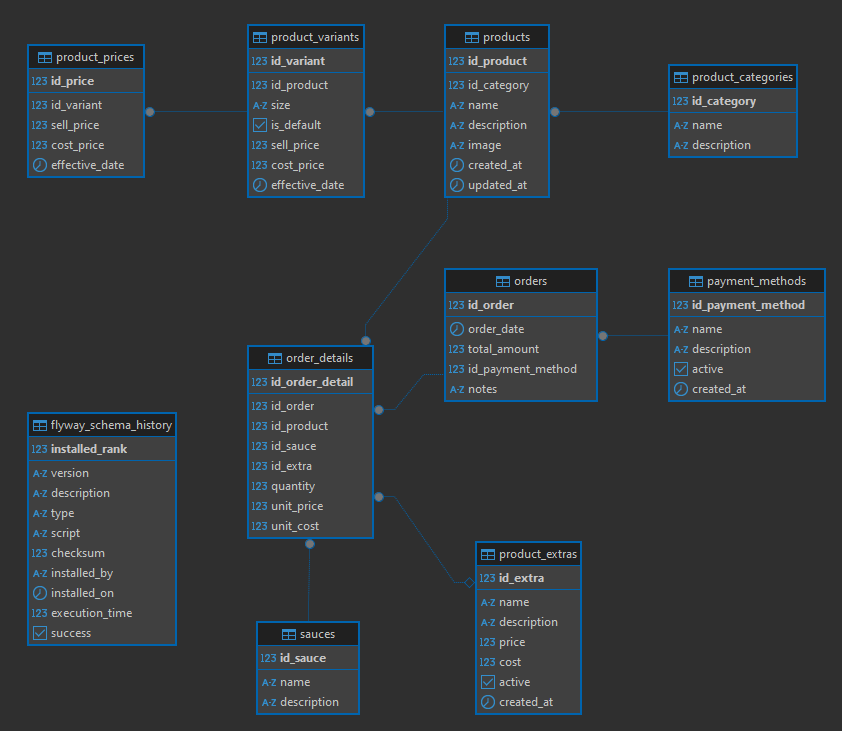

# 🌽 Maíz de mi Corazón

Aplicación web desarrollada en **Java 17** con **Spring Boot** y **PostgreSQL** para gestionar y controlar ventas de elotes, esquites y sus variantes. Pensada para administrar productos, pedidos, métodos de pago, y extras personalizados.

---

## 📌 Tecnologías

- Java 17
- Spring Boot 3.x
- PostgreSQL
- JPA / Hibernate
- Railway (opcional en producción)
- Mermaid para diagramado ER

---

## 📊 Diagrama Entidad-Relación (ER)

> El diagrama editatable del modelo de datos se encuentra en `main/respurces/db/migration/mdmc.erd` en formato **GraphQL**.

---

## 🗄️ Modelo de Base de Datos

La base de datos se compone de las siguientes tablas:

- `payment_methods` — Métodos de pago disponibles.
- `product_categories` — Categorías de productos (ej. elotes, esquites).
- `product_extras` — Extras opcionales (ej. queso extra, chile en polvo).
- `sauces` — Salsas disponibles.
- `products` — Productos disponibles para la venta.
- `orders` — Registro de ventas realizadas.
- `order_details` — Detalle de los productos vendidos en cada orden.

### 📊 Diagrama conceptual (descripción rápida)

- Un **producto** pertenece a una **categoría**.
- Una **orden** puede tener múltiples **detalles de orden**.
- Cada **detalle de orden** incluye un **producto**, una **salsa**, y opcionalmente un **extra**.
- Las órdenes se pagan mediante un **método de pago**.

---

## ⚙️ Configuración de perfiles

La aplicación utiliza perfiles Spring para manejar diferentes entornos de configuración:
## 📝 Nota: Las variables se obtienen desde Environment variables.

### application.properties

```properties
spring.profiles.active=${ACTIVE_PROFILE}
server.port=8081
spring.jpa.hibernate.ddl-auto=validate
spring.jpa.properties.hibernate.validator.fail_fast=true
spring.mvc.format.date=yyyy-MM-dd
```

### application-dev.properties (desarrollo local)

```properties
environment.name=dev
spring.datasource.url=jdbc:postgresql://localhost:5432/mdmc_db
spring.datasource.username=postgres
spring.datasource.password=postgres
spring.jpa.show-sql=true
spring.jpa.properties.hibernate.format_sql=true
```

### application-prod.properties (producción Railway)

```properties
environment.name=prod
spring.datasource.url=jdbc:postgresql://${PGHOST}:${PGPORT}/${PGDATABASE}
spring.datasource.username=${PGUSER}
spring.datasource.password=${PGPASSWORD}
```

### application-remote.properties (entorno remoto personalizado)

```properties
environment.name=remote
spring.datasource.url=${RLWY_DB_URL}
spring.datasource.username=${RLWY_USER}
spring.datasource.password=${RLWY_PASS}
```

---

## 📦 Estructura del proyecto

```
src/main/java/com/mdmc/
├── api/
├── application/
├── domain/
├── infrastructure/
└── PosofmyheartApplication.java
```

---

## 📥 Instalación y ejecución

1. Clonar el repositorio.
2. Configurar las variables de entorno o archivos `application-*.properties`.
3. Crear base de datos PostgreSQL con el esquema proporcionado en `db/mdmc_db.sql`.
4. Ejecutar:

```bash
./mvnw spring-boot:run
```

---

## 📝 Notas

- La validación de esquema está configurada en `validate` para proteger los datos existentes.
- El puerto por defecto es **8081**.
- Formato de fecha configurado a `yyyy-MM-dd`.
- Hibernate configurado en modo `fail_fast` para validar rápidamente cualquier error de constraint.

---

## 🚀 Instalación

1. Clonar este repositorio:
   ```bash
   git clone https://github.com/maizdemicorazon/posofmyheart.git

## 🧑‍🍳 Autor

**Maíz de mi Corazón** — Sistema de control de ventas de elotes y esquites.
- [Correo](mailto:raul.e.garciacabrera@gmail.com)
- [LinkedIn](https://www.linkedin.com/in/raúlgarcía/)
