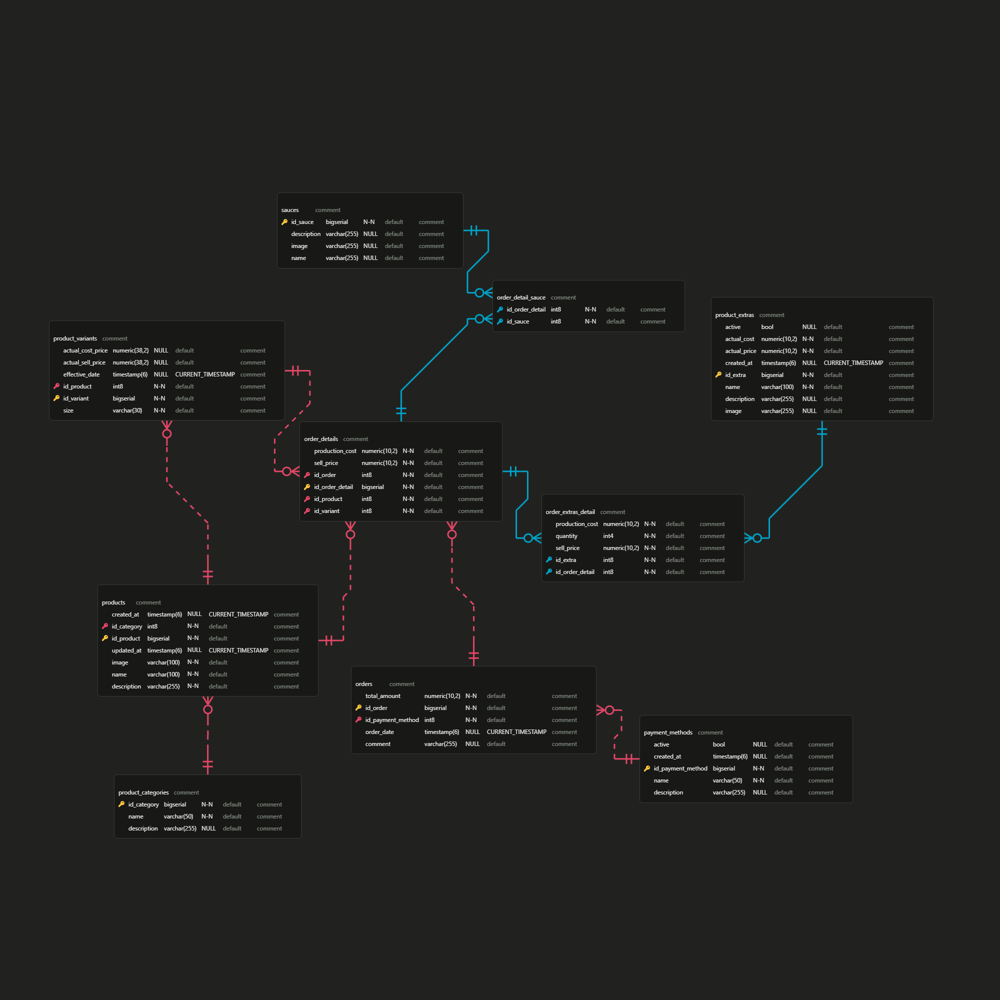

# Documentación de la Base de Datos - POS de MyHeart
Foobar is a Python library for dealing with word pluralization.

## 📌 Tabla de Contenidos

- Estructura de la Base de Datos

- Diagrama ER

- Tablas Principales

- Relaciones

- Inicialización de Datos

- Consultas Comunes

- Configuración

## 🗃️ Estructura de la Base de Datos

La base de datos está diseñada para un sistema POS (Point of Sale) especializado en venta de esquites, elotes y bebidas.


## 📊 Tablas Principales
1. product_categories
   Almacena categorías de productos (Esquites, Elotes, Bebidas)

Campos: id_category, name, description

2. products
   Contiene los productos principales del menú

Campos: id_product, id_category, name, description, image, created_at, updated_at

3. product_variants
   Variantes de tamaño/precio para cada producto

Campos: id_variant, id_product, size, sell_price, cost_price

4. orders
   Registro de órdenes/pedidos

Campos: id_order, order_date, total_amount, id_payment_method, notes

5. order_details
   Detalle de items en cada orden

Campos: id_order_detail, id_order, id_product, id_sauce, id_variant

🔗 Relaciones Clave
Orders → PaymentMethods: Relación muchos-a-uno (id_payment_method)

Products → ProductCategory: Relación muchos-a-uno (id_category)

OrderDetails → Orders: Relación muchos-a-uno (id_order)

ProductVariants → Products: Relación muchos-a-uno (id_product)

## 🔗 Relaciones Clave

- Orders → PaymentMethods: Relación muchos-a-uno (id_payment_method)

- Products → ProductCategory: Relación muchos-a-uno (id_category)

- OrderDetails → Orders: Relación muchos-a-uno (id_order)

- ProductVariants → Products: Relación muchos-a-uno (id_product)

## 🌱 Inicialización de Datos

- El sistema incluye un inicializador de datos que carga:

- Métodos de pago (Efectivo, Tarjetas, Transferencia)

- Categorías de productos (Esquites, Elotes, Bebidas)

- Salsas disponibles (Tradicional, Valentina, Habanero, etc.)

- Productos extras (Queso extra, Costilla extra, etc.)

- Productos principales con sus variantes

#### Ejecución: Se activa automáticamente al iniciar la aplicación en perfil dev.

## Obtener menú completo con precios:
``` sql
SELECT p.name AS product,
   v.size,
   v.sell_price AS price,
   pc.name AS category
FROM
   products p
JOIN
   product_variants v ON p.id_product = v.id_product
JOIN
   product_categories pc ON p.id_category = pc.id_category
ORDER BY
   pc.name, p.name;
```

## Calcular ventas por categoría:
``` sql
SELECT
   pc.name AS category,
   SUM(od.quantity * v.sell_price) AS total_sales
FROM
   order_details od
JOIN
   products p ON od.id_product = p.id_product
JOIN
   product_categories pc ON p.id_category = pc.id_category
JOIN
   product_variants v ON od.id_variant = v.id_variant
GROUP BY
   pc.name;
```
## Ventas por día (últimos 7 días)
``` sql
SELECT 
    DATE(order_date) AS fecha,
    COUNT(*) AS total_ordenes,
    SUM(total_amount) AS venta_total
FROM orders
WHERE order_date >= CURRENT_DATE - INTERVAL '7 days'
GROUP BY DATE(order_date)
ORDER BY fecha DESC;
```

## Productos más vendidos (top 10)
``` sql
SELECT 
    p.name AS producto,
    SUM(od.quantity) AS unidades_vendidas,
    SUM(od.quantity * pv.sell_price) AS ingresos
FROM order_details od
JOIN products p ON od.id_product = p.id_product
JOIN product_variants pv ON od.id_variant = pv.id_variant
GROUP BY p.name
ORDER BY unidades_vendidas DESC
LIMIT 10;
```
## Productos con sus variantes y margen de ganancia

``` sql
SELECT 
    p.name AS producto,
    v.size AS tamaño,
    v.sell_price AS precio_venta,
    v.cost_price AS costo,
    (v.sell_price - v.cost_price) AS ganancia_unitaria,
    ROUND(((v.sell_price - v.cost_price) / v.cost_price * 100), 2) AS margen_porcentaje,
    pc.name AS categoria
FROM 
    products p
JOIN 
    product_variants v ON p.id_product = v.id_product
JOIN 
    product_categories pc ON p.id_category = pc.id_category
ORDER BY 
    margen_porcentaje DESC;
```


## Inventario de productos (con margen de ganancia)

``` sql
SELECT 
    p.name,
    v.size,
    v.cost_price AS costo,
    v.sell_price AS precio_venta,
    ROUND((v.sell_price - v.cost_price) / v.cost_price * 100, 2) AS margen_porcentaje
FROM product_variants v
JOIN products p ON v.id_product = p.id_product
ORDER BY margen_porcentaje DESC;
```
## Ticket promedio por método de pago
``` sql
SELECT 
    pm.name AS metodo_pago,
    COUNT(*) AS transacciones,
    AVG(o.total_amount) AS ticket_promedio
FROM orders o
JOIN payment_methods pm ON o.id_payment_method = pm.id_payment_method
GROUP BY pm.name;
```

## Horas pico de ventas
``` sql
SELECT 
    EXTRACT(HOUR FROM order_date) AS hora,
    COUNT(*) AS ordenes
FROM orders
GROUP BY EXTRACT(HOUR FROM order_date)
ORDER BY ordenes DESC;
```

## Buscar productos por categoría con sus variantes
``` sql
SELECT 
    p.name AS producto,
    p.description,
    v.size,
    v.sell_price AS precio
FROM products p
JOIN product_variants v ON p.id_product = v.id_product
WHERE p.id_category = 1  -- ID de categoría (Esquites)
ORDER BY p.name, v.sell_price;
```
##  Resumen diario (para pantalla principal)
``` sql
SELECT 
    COUNT(*) AS ordenes_hoy,
    SUM(total_amount) AS venta_hoy,
    (SELECT SUM(total_amount) FROM orders 
     WHERE DATE(order_date) = CURRENT_DATE - INTERVAL '1 day') AS venta_ayer
FROM orders
WHERE DATE(order_date) = CURRENT_DATE;
```

## Distribución de ventas por categoría (para gráfico)
``` sql
SELECT 
    pc.name AS categoria,
    ROUND(SUM(o.total_amount) / (SELECT SUM(total_amount) FROM orders) * 100, 2) AS porcentaje
FROM orders o
JOIN order_details od ON o.id_order = od.id_order
JOIN products p ON od.id_product = p.id_product
JOIN product_categories pc ON p.id_category = pc.id_category
GROUP BY pc.name;
```

## Run

``` bash
./mvnw spring-boot:run -Dspring-boot.run.profiles=dev
```

## License
#### Todo los derechos reservados.