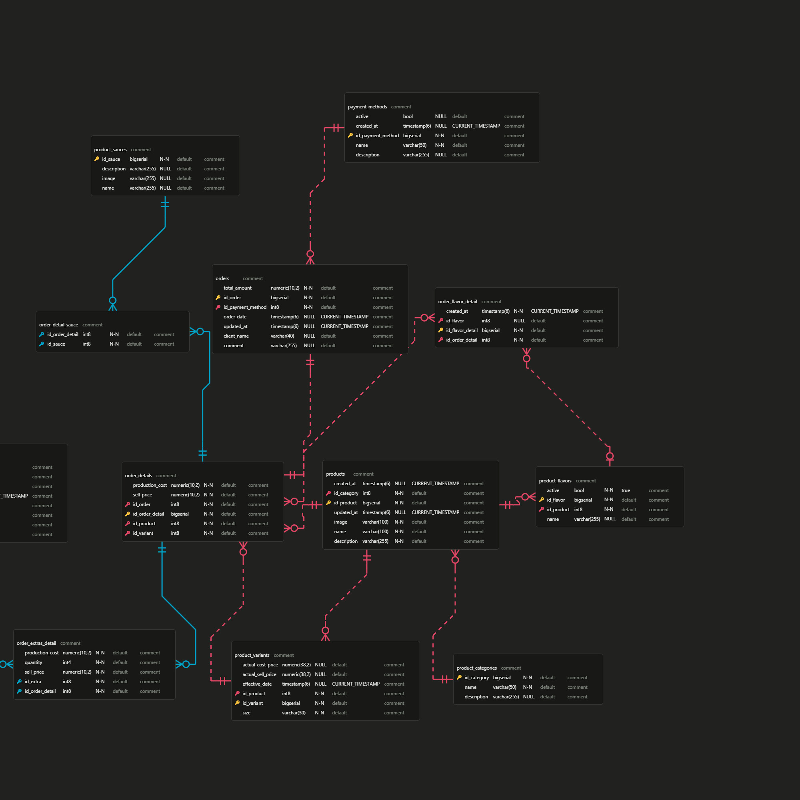

# Documentación Actualizada de la Base de Datos - POS de MyHeart

## 📌 Tabla de Contenidos

- Estructura de la Base de Datos
- Diagrama ER
- Tablas Principales
- Relaciones Clave
- Inicialización de Datos
- Consultas Comunes
- Configuración
- Ejecución del Sistema

## 🗃️ Estructura de la Base de Datos

La base de datos está diseñada para un sistema POS (Point of Sale) especializado en venta de esquites, elotes y bebidas, con capacidad para manejar variantes de productos, extras, salsas y sabores.



## 📊 Tablas Principales

### 1. payment_methods
Almacena los métodos de pago disponibles (Efectivo, Tarjetas, Transferencia)

**Campos:**
- id_payment_method (PK)
- name
- description
- active
- created_at

### 2. product_categories
Categorías de productos (Esquites, Elotes, Bebidas)

**Campos:**
- id_category (PK)
- name
- description

### 3. products
Productos principales del menú

**Campos:**
- id_product (PK)
- id_category (FK)
- name
- description
- image
- created_at
- updated_at

### 4. product_variants
Variantes de tamaño/precio para cada producto

**Campos:**
- id_variant (PK)
- id_product (FK)
- size
- actual_sell_price
- actual_cost_price
- effective_date

### 5. product_extras
Extras disponibles para los productos (Queso extra, Costilla extra, etc.)

**Campos:**
- id_extra (PK)
- name
- description
- image
- actual_price
- actual_cost
- active
- created_at

### 6. product_sauces
Salsas disponibles (Tradicional, Valentina, Habanero, etc.)

**Campos:**
- id_sauce (PK)
- name
- description
- image

### 7. product_flavors
Sabores disponibles para productos

**Campos:**
- id_flavor (PK)
- id_product (FK)
- name
- active

### 8. dailyEarnings
Registro de órdenes/pedidos

**Campos:**
- id_order (PK)
- id_payment_method (FK)
- order_date
- total_amount
- client_name
- comment
- updated_at

### 9. order_details
Detalle de items en cada orden

**Campos:**
- id_order_detail (PK)
- id_order (FK)
- id_product (FK)
- id_variant (FK)
- sell_price
- production_cost

### 10. order_extras_detail
Extras asociados a cada item de orden

**Campos:**
- id_order_detail (FK, PK)
- id_extra (FK, PK)
- quantity
- sell_price
- production_cost

### 11. order_flavor_detail
Sabores asociados a cada item de orden

**Campos:**
- id_flavor_detail (PK)
- id_order_detail (FK)
- id_flavor (FK)
- created_at

### 12. order_detail_sauce
Salsas asociadas a cada item de orden

**Campos:**
- id_order_detail (FK, PK)
- id_sauce (FK, PK)

## 🔗 Relaciones Clave

1. **Orders → PaymentMethods**: Relación muchos-a-uno (id_payment_method)
2. **Products → ProductCategory**: Relación muchos-a-uno (id_category)
3. **ProductVariants → Products**: Relación muchos-a-uno (id_product)
4. **ProductFlavors → Products**: Relación muchos-a-uno (id_product)
5. **OrderDetails → Orders**: Relación muchos-a-uno (id_order)
6. **OrderDetails → Products**: Relación muchos-a-uno (id_product)
7. **OrderDetails → ProductVariants**: Relación muchos-a-uno (id_variant)
8. **OrderExtrasDetail → OrderDetails**: Relación muchos-a-uno (id_order_detail)
9. **OrderExtrasDetail → ProductExtras**: Relación muchos-a-uno (id_extra)
10. **OrderFlavorDetail → OrderDetails**: Relación muchos-a-uno (id_order_detail)
11. **OrderFlavorDetail → ProductFlavors**: Relación muchos-a-uno (id_flavor)
12. **OrderDetailSauce → OrderDetails**: Relación muchos-a-uno (id_order_detail)
13. **OrderDetailSauce → ProductSauces**: Relación muchos-a-uno (id_sauce)

## 🌱 Inicialización de Datos

El sistema incluye un inicializador de datos que carga:

- Métodos de pago (Efectivo, Tarjeta, Transferencia)
- Categorías de productos (Esquites, Elotes, Bebidas)
- Salsas disponibles (Tradicional, Valentina, Habanero, etc.)
- Productos extras (Queso extra, Costilla extra, etc.)
- Productos principales con sus variantes
- Sabores disponibles para productos

## 🔍 Consultas Comunes

```sql
-- Obtener órdenes con detalles completos
SELECT o.id_order, o.order_date, o.total_amount, pm.name as payment_method,
       p.name as product, pv.size, od.sell_price
FROM dailyEarnings o
JOIN payment_methods pm ON o.id_payment_method = pm.id_payment_method
JOIN order_details od ON o.id_order = od.id_order
JOIN products p ON od.id_product = p.id_product
JOIN product_variants pv ON od.id_variant = pv.id_variant;

-- Obtener extras asociados a una orden
SELECT od.id_order_detail, p.name as product, pe.name as extra, oed.quantity, oed.sell_price
FROM order_extras_detail oed
JOIN order_details od ON oed.id_order_detail = od.id_order_detail
JOIN product_extras pe ON oed.id_extra = pe.id_extra
JOIN products p ON od.id_product = p.id_product;
```

## ⚙️ Configuración

La base de datos utiliza PostgreSQL con las siguientes configuraciones principales:

- Codificación: UTF-8
- Esquema: public
- Índices creados para optimizar consultas frecuentes
- Restricciones de integridad referencial

## 🚀 Ejecución del Sistema

Para iniciar la aplicación en modo desarrollo:

```bash
 ./mvnw spring-boot:run -Dspring-boot.run.profiles=dev
```

## 📄 Licencia

Todos los derechos reservados.